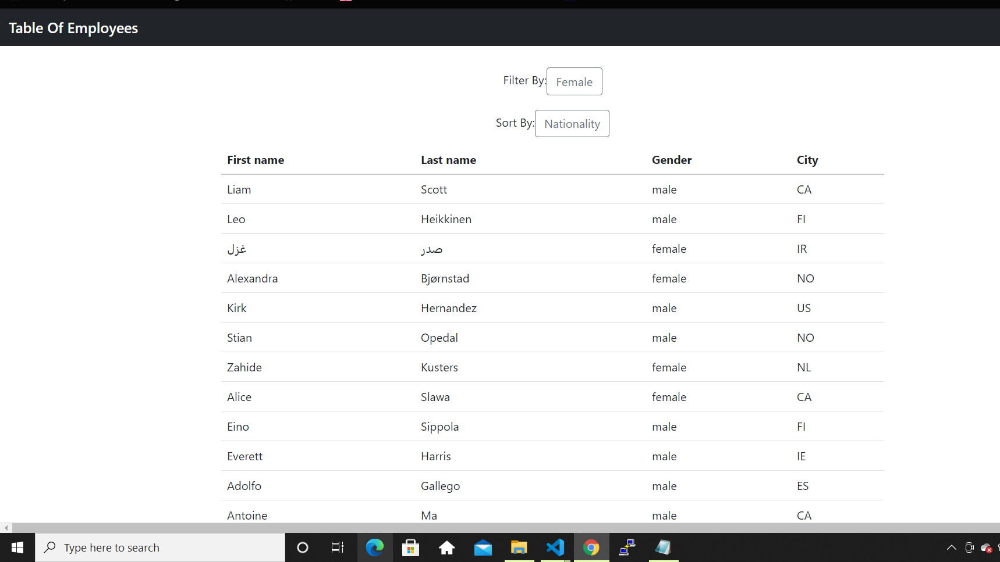

# Table Of employees

## Description

Using React and the randomuser API I was able to display a Table of users allowing users to filter and sort them based on the propterties. 

## Picture of Application

## Video of Application

https://drive.google.com/file/d/1nTzzggVjXuTaTts5QA_FFO2ZwMifAUBt/view

## Link To Deployed Application